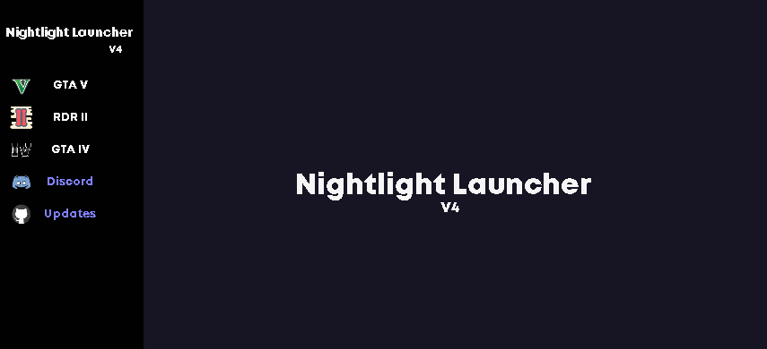

# Nightlight Game Launcher

  This program helps you launch games without their launchers.
  
  
  
  

## More About the Program
- {x} [Download Last Release](https://github.com/onajlikezz/Nightlight-Game-Launcher/releases)
- {x} [YouTube Tutorial](https://www.youtube.com/watch?v=WnMs0cusbwk)
- {x} [Support](#SUPPORT)

## SUPPORT
If you have any questions [click here](https://discord.gg/pBFaCQQVBV) to join discord server
or add me on telegram: onjlkz

## SUPPORT ME
Donations on PayPal: paypal.me/2vvq

  

 
