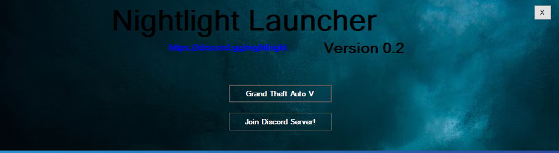

# Nightlight Game Launcher

  This program helps you launch games without their launchers.
  
  
  
  

## More About the Program
- {x} [Download Last Release](https://github.com/onajlikezz/Nightlight-Game-Launcher/releases)
- {x} [YouTube Tutorial](https://www.youtube.com/watch?v=WnMs0cusbwk)
- {x} [Support](#SUPPORT)

## SUPPORT
IF YOU HAVE ANY QUESTIONS [CLICK HERE](https://discord.gg/nightliight) TO ENTER DSCORD SERVER
OR ADD ME ON DISCORD: onajlikezz#1111

<!--🐍📈SNAKEGRAPH / 🌐WEBSITE: https://github.com/Platane/snk -->

