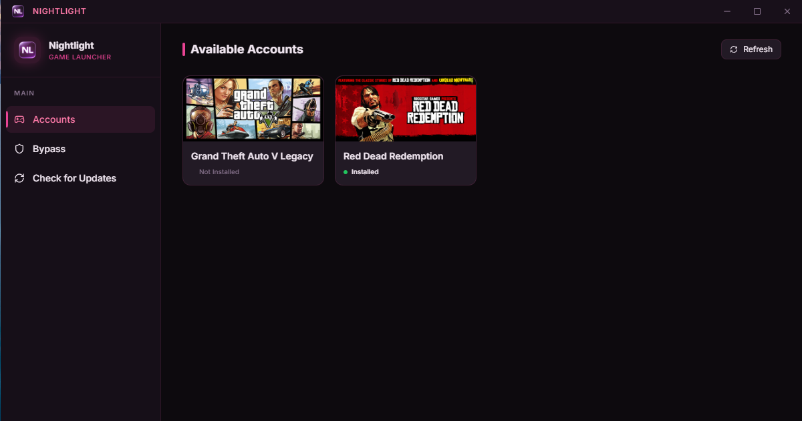

# 🌌 Nightlight Game Launcher (NLGL)

  <strong>Streamline your library. Launch games without the bloat.</strong>

  

  
  
  

---

## 🚀 What is Nightlight?
Nightlight is a lightweight utility designed to help you manage and launch your games directly, bypassing heavy third-party launchers. 

### 🌟 New in Version 5
I'm currently working hard on **NLGL V5**. Here is what’s landing:
*   **Account Manager:** Switch between accounts seamlessly and play your selected games directly on Steam.
*   **Refined Bypasses:** Carrying over the proven methods from V4 with new expansions planned.
*   **New UI:** A cleaner, faster experience.

---

## ⚠️ Important Note on Transparency
I believe in being 100% honest with the community.
1.  **Open Source:** Due to community concerns regarding false positives from antivirus software, V4 is now [open source](https://github.com/onajlikezz/Nightlight-Game-Launcher/blob/main/SourceCode.rar).
2.  **The Code:** I lost the original project files, so the source provided is **decompiled via dnSpy**. You are welcome to audit the code yourself to verify its safety.
3.  **Functionality:** The program functions by downloading necessary game files and placing them into your game directory. 
4.  **Security:** While I use this personally and test everything thoroughly, always use third-party tools at your own discretion.

---

## 🛠 Getting Started
*   📥 [**Download Latest Release**](https://github.com/onajlikezz/Nightlight-Game-Launcher/releases)
*   📖 [**Watch V4 Tutorial**](https://www.youtube.com/watch?v=dcdWfy4k98s)

---

## 💬 Support & Community
Need help or want to suggest a feature for V5?
*   **Discord:** [Join our server](https://discord.gg/yXeWQ6arcq)
*   **Telegram:** `@onjlkz`

### ☕ Support My Work
If NLGL has helped you out, consider buying me a coffee to keep the development going:
*   (Soon)

---

  
  
  
  
  
  
  

