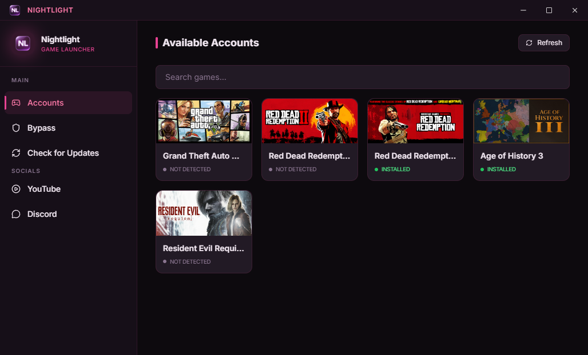

# 🌌 Nightlight Game Launcher (V5)

  <strong>Lightweight Electron app to manage your Steam library. Switch accounts, apply bypasses, and launch games — without bloat.</strong>

  

  
  
  

---

## ✨ What’s inside V5

- **Game Library & Accounts** – Browse your available games, instantly log in, and launch Steam seamlessly.
- **Bypass Manager** – View all supported titles, set custom game paths, and inject/verify bypasses with progress feedback.
- **Clean, modern UI** – Fast, animated, and easy to use. No unnecessary overhead.

---

## 🚀 Getting Started

1. **Download** the latest release from [Releases](https://github.com/onajlikezz/Nightlight-Game-Launcher/releases).
2. **Enter your access key** – required to unlock the launcher.
3. **Use the sidebar** to navigate between Home, Accounts, and Bypass.

> 📺 **V5 tutorial** – coming soon (once I’ve finished building it!).

---

## 🔓 Open Source & Transparency

This project is fully open source. You can audit every line of code yourself.  
I believe in honesty and transparency – that’s why the entire launcher will be available in this repository.

---

## 💬 Community & Support

- **Discord:** [Join the server](https://discord.gg/yXeWQ6arcq)
- **Telegram:** `@onjlkz`

If you’d like to support development, stay tuned – more options coming soon.

---

  
  
  
  
  
  
  

